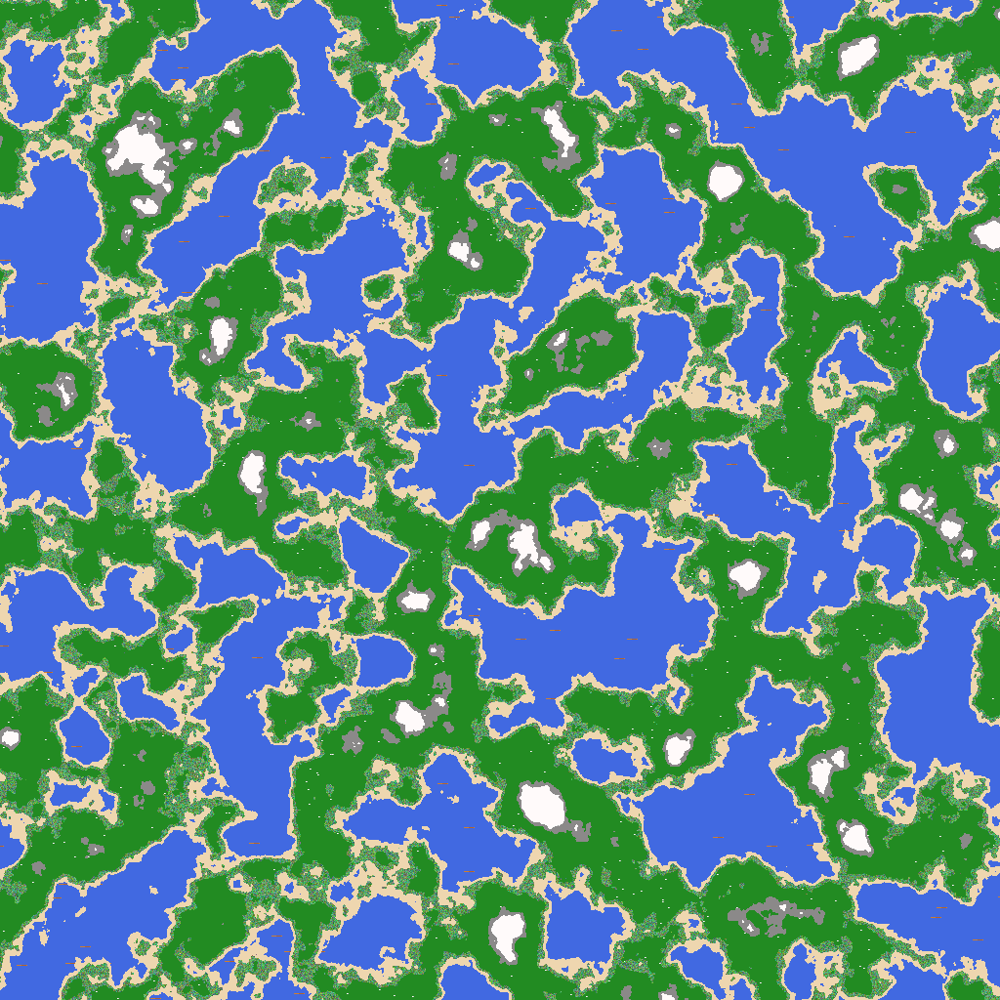

# Mini World Generator

This mini world generator uses Perlin noise to generate randomly generated worlds. There are three world types, lava, regular and random which randomly generates colours. 

## How to install

Open <a href='https://dsochamp.github.io/Mini-World'>dsochamp.github.io/Mini-World</a> and download the executable from there or run main.py.